# SuperNovae Registry

> **The open-source package registry for AI workflow skills, agents, and workflows.**

[](LICENSE)
[](#packages)
[](CONTRIBUTING.md)

---

## 🦋 🐔 🐤 Mascots

| Mascot | Role | What it does |
|--------|------|--------------|
| 🦋 **Nika** | **Runtime** | Executes YAML workflows, runs chat UI, launches agents |
| 🐔 **Agent** | **One of 5 verbs** | Multi-turn agentic loop with MCP tools, spawns subagents |
| 🐤 **Subagent** | **Spawned by agent** | Executes subtask, returns result to parent, depth-limited |

> **Nika is NOT an agent.** Nika is the runtime (🦋 papillon) that orchestrates agents (🐔 space chicken).

---

## Overview

SuperNovae Registry is a **git-based package registry** for distributing AI development assets. It provides reusable skills, agents, and workflows that integrate with [Claude Code](https://claude.ai/code), [Cursor](https://cursor.sh), and the [Nika workflow engine](https://github.com/supernovae-studio/nika).

```mermaid
%%{init: {'theme': 'base', 'themeVariables': {'lineColor': '#64748b'}}}%%
flowchart TB
    classDef registry fill:#6366f1,stroke:#4f46e5,stroke-width:2px,color:#ffffff
    classDef package fill:#10b981,stroke:#059669,stroke-width:2px,color:#ffffff
    classDef tool fill:#f59e0b,stroke:#d97706,stroke-width:2px,color:#ffffff
    classDef user fill:#8b5cf6,stroke:#7c3aed,stroke-width:2px,color:#ffffff

    subgraph Registry["📦 SuperNovae Registry"]
        direction TB
        NIKA["@nika/*<br/>8 workflow skills"]:::package
        NOVANET["@novanet/*<br/>2 graph skills"]:::package
        SHARED["@shared/*<br/>10 dev skills"]:::package
        WORKFLOWS["@workflows/*<br/>31 ready-to-use"]:::package
    end

    DEV["👤 Developer"]:::user
    CLI["spn CLI"]:::tool
    CLAUDE["Claude Code"]:::tool
    CURSOR["Cursor IDE"]:::tool

    DEV --> CLI
    CLI -->|"spn pkg install"| Registry
    Registry --> CLAUDE
    Registry --> CURSOR
```



---

## Quick Start

### Installation

```bash
# Install spn CLI (via npm)
npm install -g @supernovae/cli

# Or use the ZSH plugin directly
curl -fsSL https://supernovae.sh/install | sh
```

### Install Packages

```bash
# Install a workflow skill
spn pkg install @nika/nika-run

# Install multiple packages
spn pkg install @shared/brainstorming @workflows/pr-description

# Install all dependencies from spn.yaml
spn pkg install
```

### Use in Your Project

```yaml
# spn.yaml
name: my-project
version: 1.0.0

dependencies:
  skills:
    - "@nika/nika-run@1.0.0"
    - "@shared/brainstorming@1.0.0"
  workflows:
    - "@workflows/code-review@1.0.0"
```

---

## Packages

### Package Scopes


| Scope | Description | Count |
|-------|-------------|-------|
| [`@nika`](packages/@nika) | Nika workflow engine skills | 8 |
| [`@novanet`](packages/@novanet) | NovaNet knowledge graph skills | 2 |
| [`@shared`](packages/@shared) | Cross-project development skills | 10 |
| [`@workflows`](packages/@workflows) | Ready-to-use workflow templates | 31 |

---

### @nika — Workflow Engine Skills

Skills for authoring and debugging Nika YAML workflows.

| Package | Description |
|---------|-------------|
| [`nika-run`](packages/@nika/nika-run) | Run workflows with validation |
| [`nika-debug`](packages/@nika/nika-debug) | Debug with traces and logging |
| [`nika-spec`](packages/@nika/nika-spec) | Workflow specification reference |
| [`nika-yaml`](packages/@nika/nika-yaml) | YAML authoring guide |
| [`nika-binding`](packages/@nika/nika-binding) | Data binding syntax (`use:`, `{{}}`) |
| [`nika-arch`](packages/@nika/nika-arch) | Architecture diagrams |
| [`nika-diagnose`](packages/@nika/nika-diagnose) | Troubleshooting checklist |
| [`workflow-validate`](packages/@nika/workflow-validate) | Schema validation |

---

### @novanet — Knowledge Graph Skills

Skills for NovaNet schema design and graph operations.

| Package | Description |
|---------|-------------|
| [`schema-validate`](packages/@novanet/schema-validate) | Schema validation patterns |
| [`novanet-yaml`](packages/@novanet/novanet-yaml) | YAML schema authoring |

---

### @shared — Development Skills

Cross-project skills for code quality and productivity.

| Package | Description |
|---------|-------------|
| [`brainstorming`](packages/@shared/brainstorming) | Socratic ideation workflow |
| [`test-driven-development`](packages/@shared/test-driven-development) | TDD methodology |
| [`systematic-debugging`](packages/@shared/systematic-debugging) | 4-phase debugging |
| [`code-review`](packages/@shared/code-review) | Automated code review |
| [`codebase-audit`](packages/@shared/codebase-audit) | Dead code detection |
| [`security-audit`](packages/@shared/security-audit) | Vulnerability scanning |
| [`token-audit`](packages/@shared/token-audit) | API token management |
| [`workspace-nav`](packages/@shared/workspace-nav) | Project navigation |
| [`release`](packages/@shared/release) | Release automation |
| [`adr`](packages/@shared/adr) | Architecture Decision Records |

---

### @workflows — Ready-to-Use Templates

Pre-built Nika workflows organized by category.

```mermaid
%%{init: {'theme': 'base', 'themeVariables': {'lineColor': '#64748b'}}}%%
mindmap
  root(("@workflows"))
    dev["🛠️ Dev Productivity"]
      pr-description
      changelog-generator
      readme-generator
      code-review
    content["📝 Content"]
      blog-post
      social-media-pack
      landing-page-copy
    research["🔍 Research"]
      web-research
      competitor-analysis
      paper-summarizer
    data["📊 Data"]
      json-transformer
      csv-analyzer
      api-aggregator
    automation["⚙️ Automation"]
      daily-standup
      meeting-notes
      release-notes
    fun["🎉 Fun"]
      weather-outfit
      recipe-wizard
      movie-night
      trivia-quiz
      fortune-teller
    examples["📚 Examples"]
      hello-world
      simple-infer
      agent-loop
```



#### Dev Productivity (8)

| Workflow | Description | Pattern |
|----------|-------------|---------|
| `pr-description` | Generate PR description from diff | Linear DAG |
| `changelog-generator` | Generate changelog from commits | Linear DAG |
| `readme-generator` | Generate README from codebase | Fan-out |
| `code-review` | AI-powered code review | Parallel |
| `api-docs-generator` | Generate OpenAPI docs | Linear DAG |
| `test-generator` | Generate unit tests | Fan-out |
| `refactor-suggestions` | Suggest refactoring | Agent loop |
| `dependency-audit` | Audit dependencies | Parallel |

#### Fun & Entertainment (9)

| Workflow | Description | Pattern |
|----------|-------------|---------|
| `weather-outfit` | Weather → outfit recommendation | fetch + infer |
| `recipe-wizard` | Ingredients → recipe | Fan-out parallel |
| `story-collab` | Multi-agent story creation | Agent loop |
| `meme-generator` | Generate meme captions | Parallel |
| `travel-planner` | AI travel itinerary | Agent orchestration |
| `movie-night` | Mood-based movie picks | Conditional |
| `trivia-quiz` | Custom trivia generation | Generation + validation |
| `fortune-teller` | Daily cosmic fortune | Creative generation |
| `github-stats` | GitHub profile card | API aggregation |

---

## Package Format

Each package follows a minimal structure:

```
packages/@scope/package-name/
├── package.yaml          # Auto-generated metadata
└── package-name.md       # Skill/workflow content
```

### package.yaml

```yaml
name: "@nika/nika-run"
version: 1.0.0
type: skill
description: Run Nika workflows with proper validation

files:
  main: nika-run.md

metadata:
  author: SuperNovae
  license: MIT
  keywords: [nika, workflow, run]
  git:
    commit: abc123
    date: 2026-02-23
```

### Skill Format

```markdown
---
name: nika-run
description: Run Nika workflows with proper validation
---

# Run Nika Workflows

[Skill content...]
```

---

## CLI Reference


| Command | Description |
|---------|-------------|
| `spn pkg install <pkg>` | Install package |
| `spn pkg install` | Install all from spn.yaml |
| `spn pkg search <query>` | Search registry |
| `spn pkg list` | List installed packages |
| `spn pkg update` | Update all packages |
| `spn pkg remove <pkg>` | Remove package |
| `spn pkg publish <pkg>` | Publish to registry |

---

## Contributing

We welcome contributions! See [CONTRIBUTING.md](CONTRIBUTING.md) for guidelines.

### Adding a New Package

1. Fork this repository
2. Create package directory: `packages/@scope/your-package/`
3. Add `your-package.md` with frontmatter
4. Submit PR — `package.yaml` is auto-generated

### Package Guidelines

- **Skills**: Markdown files with instructions for Claude/Cursor
- **Workflows**: `.nika.yaml` files with complete DAG definitions
- **Agents**: YAML agent definitions with tool configurations

---

## Related Projects

| Project | Description |
|---------|-------------|
| [Nika](https://github.com/supernovae-studio/nika) | Semantic YAML workflow engine |
| [NovaNet](https://github.com/supernovae-studio/novanet) | Knowledge graph with MCP |
| [@supernovae/cli](https://www.npmjs.com/package/@supernovae/cli) | CLI tool for package management |
| [supernovae-powers](https://github.com/supernovae-studio/supernovae-powers) | Private registry (internal) |

---

## License

MIT © [SuperNovae Studio](https://supernovae.sh)

---

<p align="center">
  <sub>Built with 🚀 by SuperNovae Studio</sub>
</p>
